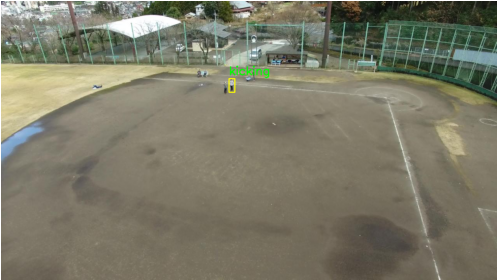

# HAR-using-Sparse-Weighted-Temporal-Attention

## Abstract

Human Activity Recognition (HAR) is a crucial field for enabling machines to understand human actions from sensor data. This project introduces a **Sparse Weighted Temporal Attention Mechanism** to enhance HAR, particularly for data from drone cameras. This technique allows the model to focus on the most important moments in a sequence of actions, which improves the accuracy and efficiency of the recognition process. By integrating this mechanism, the system can better interpret human actions, leading to more precise and reliable results for applications in healthcare, surveillance, and human-computer interaction.

***

## Methodology

The core of this project is a novel approach that integrates a Sparse Weighted Temporal Attention (SWTA) module with a robust backbone network to classify human activities from video frames.

*Overview of Methodology*

The workflow is as follows:
1.  **Temporal Frame Sampling**: Video frames are extracted and divided into segments using a **Temporal Segment Network (TSN)** to capture long-range temporal information efficiently.
2.  **Attention Mechanism**: A **Sparse Weighted Temporal Attention (SWTA)** module is applied. This module calculates optical flow between sparsely sampled frames and uses it to create an attention map, effectively highlighting motion changes. This map is then fused with the original RGB frames.
3.  **Human Detection**: The **YOLOv8** model is used to detect and crop the human subjects from the frames, isolating them from the background for more focused analysis.
4.  **Feature Extraction**: The processed frames are fed into a backbone network, an **Inception V3** architecture pre-trained on ImageNet, to extract high-level features.
5.  **Classification**: Finally, fully connected layers and a Softmax activation function classify the action into one of the predefined categories.

### Key Components

| Component | Description | Visual Representation |
| :--- | :--- | :--- |
| **Temporal Segment Network (TSN)** | Divides video into segments and sparsely samples frames to model temporal structure. | |
| **SWTA Module** | Fuses optical flow with RGB frames to focus on key temporal information. |    *Sparse weighted Temporal Attention (SWTA) Module* |
| **Human Detection (YOLOv8)** | Accurately detects and crops persons in each frame. |    *Human Detection and cropping using YOLOv8* |
| **Backbone Network (InceptionV3)**| Extracts intricate features from the processed frames. |    *Overview of Inception network* |

***

## Datasets

The model was trained and evaluated on two challenging drone-based video datasets.

1.  **Drone Action Dataset**: A total of 13 actions performed by 10 subjects, captured from a drone in hovering and following modes.
    
    *Drone Action Dataset*

2.  **Okutama Action Dataset**: Features 43 video sequences with 12 action categories, recorded by two drones at varying heights and angles.

### Dataset Comparison

| Feature | Okutama-Action | Drone-Action |
| :--- | :--- | :--- |
| **Number of actions** | 12 | 13 |
| **Number of subjects**| 9 | 10 |
| **Number of videos** | 43 | 220 |
| **Total duration** | 43 min | 44.6 min |
| **Resolution** | $3840 \times 2160$ | $1920 \times 1080$ |
| **Dataset size** | 5.3GB | 7.56GB |
*Source: Figure 2.3: Datasets Info*

***

## Results and Performance

The model was trained for 50 epochs with a batch size of 32, using the Adam optimizer and Categorical Crossentropy loss function.

### Training Performance

The model achieved a final **training accuracy of 85.01%** and a **validation accuracy of 87.40%**. The training loss was 0.6433 and the validation loss was 0.6068.

| Training Accuracy & Loss Plots |
| :---: |
|    *Model Accuracy variations* |
|    *Model Loss variations*|

### Test Set Evaluation

On the test set, the model demonstrated strong performance with an **overall accuracy of 87%**.

| Confusion Matrix | Classification Report |
| :---: | :---: |
|    *Confusion matrix* |    *Classification report* |

The classes **'running'** and **'stabbing'** were perfectly classified with a precision and recall of 1.00. Actions like **'clapping'** (recall 0.46) and **'walking'** (recall 0.58) proved more challenging.

### Prediction Examples

Here are some sample predictions from the model on test videos.

**Drone Action Dataset:**

| Correct Predictions | Incorrect Prediction |
| :---: | :---: |
|    **Predicted: Kicking, Actual: Kicking** |    **Predicted: Hitting, Actual: Running** |
|    **Predicted: Punching, Actual: Punching** |    **Predicted: Walking, Actual: Stabbing** |

**Okutama Action Dataset:**

| Correct Prediction | Incorrect Prediction |
| :---: | :---: |
|    **Predicted: Walking, Actual: Walking** |    **Predicted: kicking, Actual: Walking** |

***

## Libraries and Modules Used

This project relies on several key Python libraries:
-   **TensorFlow** & **Keras**: For building and training the deep learning model.
-   **OpenCV (cv2)**: For video processing, frame extraction, and calculating optical flow.
-   **NumPy**: For efficient numerical operations and array manipulation.
-   **Pandas**: For manipulating and analyzing data.
-   **Matplotlib**: For creating visualizations and plots.
-   **SciPy**: Used to process MATLAB annotation files for the Drone Action dataset.
